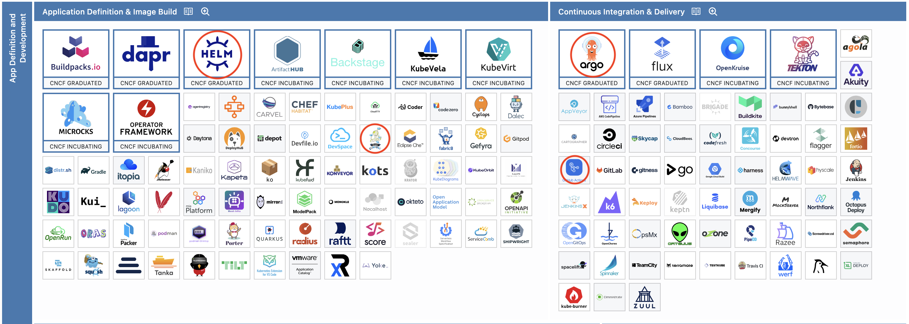
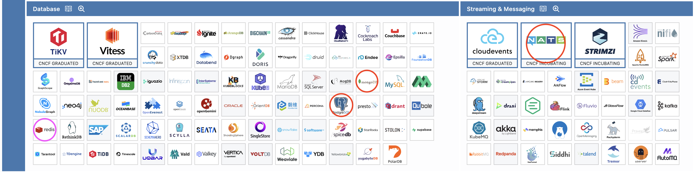
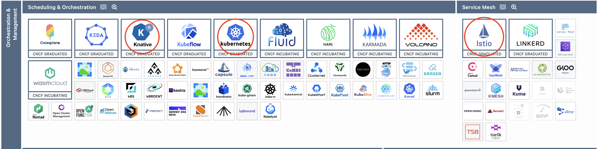
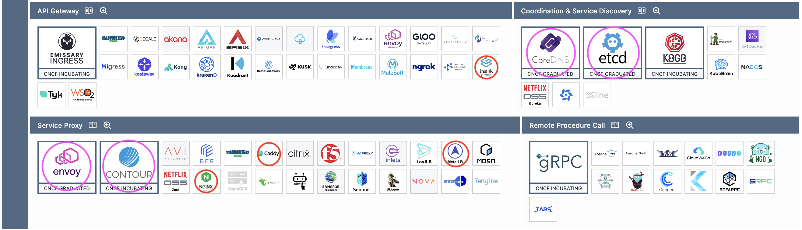
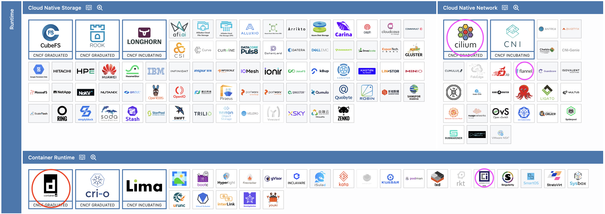
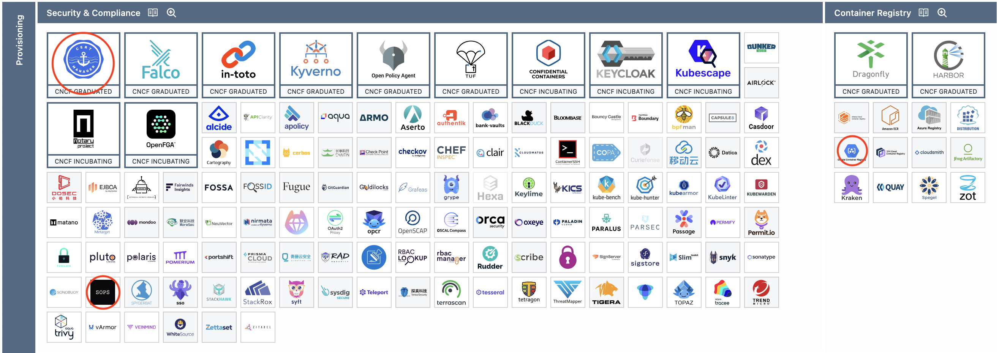
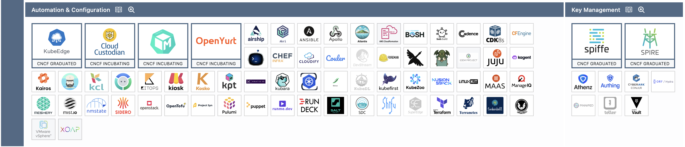
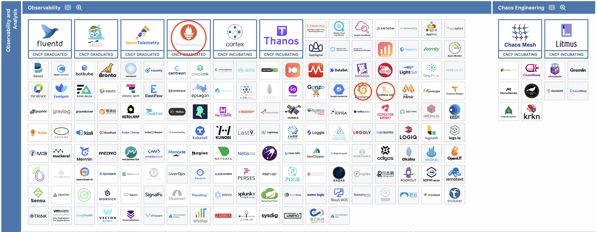
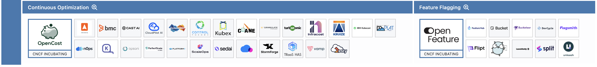

# CNCF projects that...

## I've used (red)

- **Helm** to install applicatios into Kubernetes clusters
- **Docker Compose** to run small network of containerized services locally
- **ArgoCD** to deploy services with GitOps principles
- **GitHub Actions** to run automated CI/CD workflows
- **MongoDB** and **PostgreSQL** to build stateful web applications (outside of the course)
- **NATS** to add communication layer for services within Kubernetes cluster
- **Knative** to create simple serverless Kubernetes workloads
- **Kubernetes** to automate the orchestration and management of containerized services
- **Istio** to add service mesh network with traffic and policy management to Kubernetes cluster
- **Traefik** to add a reverse proxy and load balancing gateway to my homelab (outside of the course)
- **Caddy** to add secure web servers with HTTPS in my homelab (outside of the course)
- **MetalLB** to add LoadBalancer service resolver to my homelab (outside of the course)
- **NGINX** to create simple static web apps and use it as a service reverse proxy (outside of the course)
- **containerd** as the main container runtime through Docker and Kubernetes
- **cert-manager** to add TLS certificate issuers to my homelab (outside of the course)
- **SOPS** to encrypt and decrypt Kubernetes secrets in manifest files
- **Google Container Registry** to store Docker images for GKE projects
- **Prometheus** to create metrics endpoints to allow service monitoring
- **Grafana** to query and display metrics data from the Kubernetes cluster
- **Grafana Loki** to aggregate service log data from the Kubernetes cluster

## Are dependencies of the services I've used (pink)

- **redis** is used as cache layer by ArgoCD
- **Envoy** based networking layer is used by **Contour** and Istio both of which in turn are used by Knative
- **etcd** is used as state storage by Kubernetes
- **runc** is used by **containerd** to spawn container processes
- **Cilium** is used by Google Kubernetes Engine as the default CNI provider
- **Flannel** is used by k3s/k3d as the default CNI provider
- **CoreDNS** is used by Kubernetes for in-cluster DNS resolution

---

