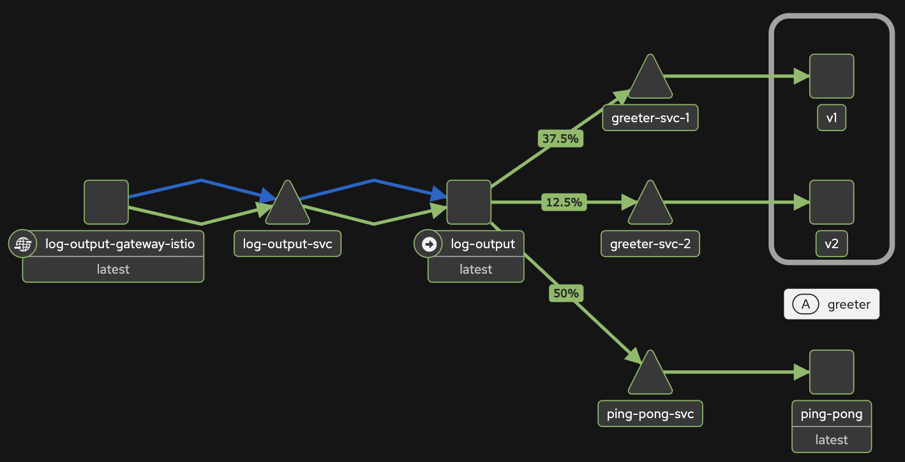
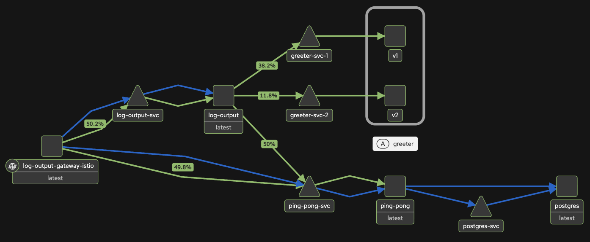

# greeter

These instructions add **greeter** application with weight-based routing on top of **log-output** application, First, follow the instructions in [log-output README.md](../log-output/README-k3d.md) to setup Istio in your `k3d` cluster properly and start both **log-output** and **ping-pong** applications.

Next step is to add applications in `exercises` namespace to the Istio's (ambient mode) service mesh and add a waypoint proxy (required for Layer 7 HTTP splitting to work) to the same namespace:

```bash
kubectl label namespace exercises istio.io/dataplane-mode=ambient
istioctl waypoint apply --namespace exercises --enroll-namespace --wait
```

**greeter** application can then be deployed to the cluster with:

```bash
kubectl apply -f manifests
```

To check that two different versions of the application can be accessed through `greeter-svc`, check the logs. It should print `Server running at http://localhost:3000` for 2 different deployments.
`

```bash
kubectl logs svc/greeter-svc --namespace exercises --all-pods
```

Accessing [http://localhost:8080](http://localhost:8080) should display `greeting: Hello from version 1` 75 % of the time and `greeting: Hello from version 2` 25 % of the time.

To visualize the traffic using Istio's Kiali dashboard, both Kiali and Prometheus need to installed to the cluster. Prometheus can be installed by following instructions in [prometheus folder](../prometheus/). Loki, Grafana Alloy (k8smon) or Grafana don't need to be installed. When Prometheus server is running, Kiali can be installed with the following command.

```bash
kubect apply -f kiali.yaml
```

The dashboard can be then opened with following command. Open **Traffic Graph** and select only **Namespace: exercises** from the list. Use **Versioned app graph** and check **Display** -> **Show Edge Labels** -> **Traffic Distribution**.

```bash
istioctl dashboard kiali
```

Simulate traffic to the main page with following command:

```bash
for i in $(seq 1 100); do curl -sSI -o /dev/null http://localhost:8080; done
```



**ping-pong** application does not query the database on main page requests as it reads them from memory. To see traffic flow to the database, simulate traffic to `/pingpong` endpoint, too.

```bash
for i in $(seq 1 100); do curl -sSI -o /dev/null http://localhost:8080/pingpong; done
```


