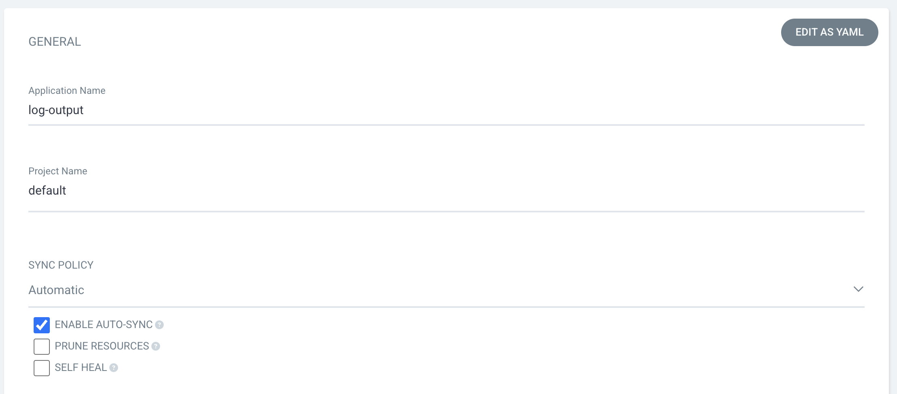
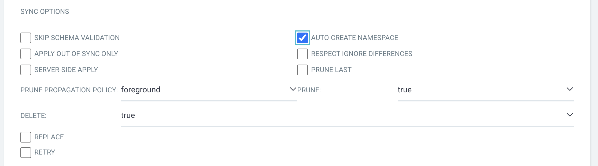
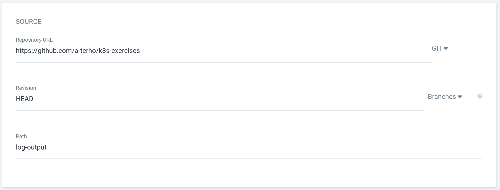
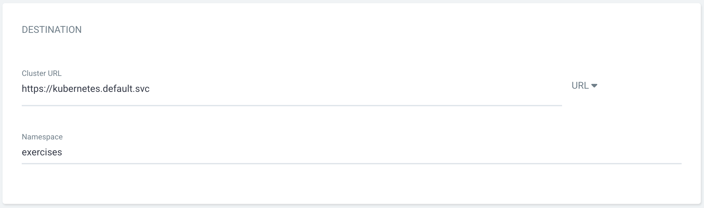

# add log-output as ArgoCD app

First make sure the Kubernetes cluster is running on GKE and Gateway API is enabled in the cluster and `kubectl` points to cluster context.

Add ArgoCD to the cluster:

```bash
kubectl create namespace argocd
kubectl apply -n argocd --server-side --force-conflicts -f https://raw.githubusercontent.com/argoproj/argo-cd/stable/manifests/install.yaml
```

Then add a way to access ArgoCD from outside the cluster, such as exposing the service IP through LoadBalancer resouce. IP can be printed with the following command when it is available.

```bash
kubectl patch svc argocd-server -n argocd -p '{"spec": {"type": "LoadBalancer"}}'
```

```bash
echo "http://$(kubectl get svc --namespace=argocd | grep "LoadBalancer" | awk '{print $4}')"
```

Login to ArgoCD. Default `admin` account password can be printed with this command:

```bash
kubectl get -n argocd secrets argocd-initial-admin-secret -o yaml | grep "password:" | awk '{print $2}' | base64 -d
```

Create **NEW APP** with following settings:






The syncing process should start after creation. If **ping-pong** application and its database is not running, ArgoCD will eventually report service as being degraded. To fix this, follow the instruction in the [log-output README.md file](../README.md). This should turn service to healthy state.

In order for the automated workflow to work properly, all of these need to be set properly:

- `DOCKERHUB_USERNAME` needs to be set in **Settings** -> **Secrets and variables** -> **Actions** -> **Variables** -> **Repository variables**.
- `DOCKERHUB_TOKEN` (which has write permissions for your Docker Hub account) needs to be set in **Settings** -> **Secrets and variables** -> **Actions** -> **Secrets** -> **Repository secrets**.
- GitHub Actions permissions need to changed under **Settings** -> **Actions** -> **General** -> **Workflow permissions** to **Read and write permissions**.
