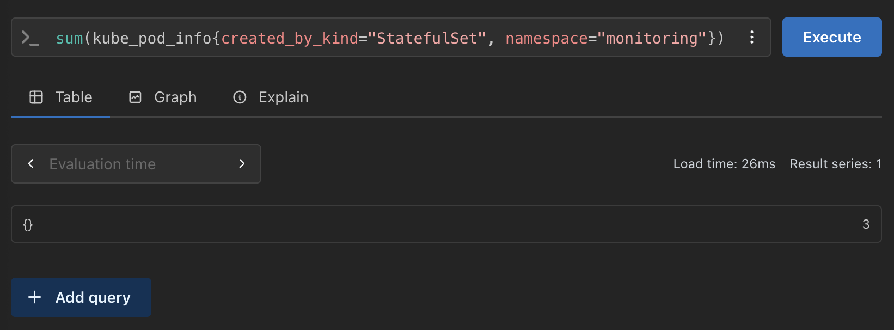

# PromQL

Answer for [exercise 4.3.](https://courses.mooc.fi/org/uh-cs/courses/devops-with-kubernetes-2026/chapter-5/update-strategies-and-prometheus#e9992e03-fa5f-43f7-9e04-45e60dfd1cf3) Using the following query finds all the StatefulSets in `monitoring` namespace as it is called in my cluster. Just replace `monitoring` with `prometheus` for similar effect.

