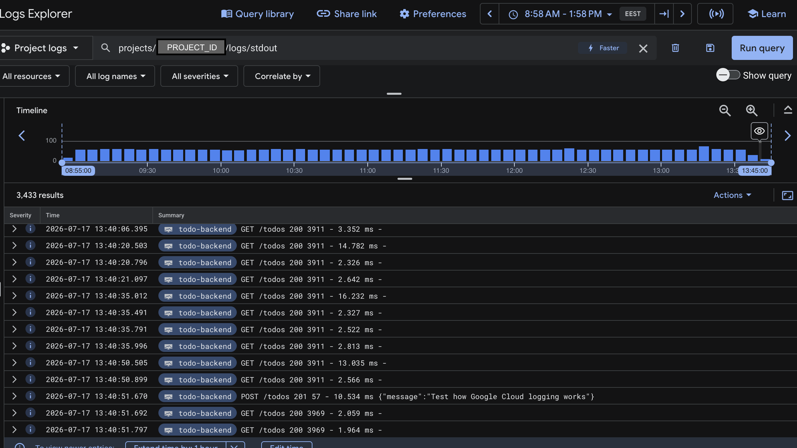

# todo-app

These instructions are for deploying the application on the Google Kubernetes Engine (GKE). To deploy it into a local `k3d` cluster instead, [follow the instructions here](./README-k3d.md).

To see how to setup deployment system using ArgoCD, check [argocd](./argocd/) folder.

---

First make sure the Kubernetes cluster is running on GKE and `kubectl` points to its context. Then apply manifests from the `kustomization.yaml` file with:

```bash
kubectl apply -k .
```

To check that the pod is running, use:

```bash
kubectl logs -f deployment/todo-app-dep --namespace=project
```

The logs should have printed:

```plaintext
▲ Next.js *.*.*
- Local:         http://localhost:3000
- Network:       http://0.0.0.0:3000
✓ Ready in *ms
```

The ingress setup may take up to 10 minutes. Once it's ready, you can connect to the address that is printed with the following command. If it does not print an address, you need to wait and try again in a few minutes. And even when the IP is available, it might still take a while before it works.

```bash
echo http://$(kubectl get ing --namespace=project | grep todo-app-ingress | grep -oE '([0-9]{1,3}\.){3}[0-9]{1,3}')
```

The app receives todos from **todo-backend** service which needs to be started seperately. Otherwise app will display error message about app not being healthy and will not work properly. To start the service, use:

```bash
kubectl apply -k ../todo-backend
```

Please note that **todo-backend** does not initialize the namespace it uses. This is not an issue when **todo-app** is started first. To check that the service is running, use:

```bash
kubectl logs -f deployment/todo-backend-dep --namespace=project
```

The logs should say: `Server running at http://localhost:3000`. Kubernetes should also have sent probe requests by the time the pod is running. Database might not be reachable immediately. The backend runs database migrations as a seperate job. You can check whether migrations ran successfully from the logs with the following command. Todo list functionality is not available before that.

```bash
kubectl logs -f jobs/db-migrate --all-containers --namespace=project
```

By default, a cronjob will post a new todo list item automatically every hour if the backend service is available. Backend enpoint is only available within the Kubernetes cluster. To access the backend enpoint locally at http://localhost:3001/todos, use port forwarding:

```bash
kubectl port-forward --namespace=project svc/todo-backend-svc 3001:1234
```

You can temporarily break the app using the provided button on main page. It should spin up a new pod within a few minutes thanks to liveness probes.

Dropping database connection can be simulated by stopping the PostgreSQL StatefulSet resource. This will cause backend readiness probe to fail. It will make Kubernetes stop routing traffic to the backend altogether, making it unavailable and causes an unrecoverable error that Kubernetes can't currently restore automatically. Currently there is no implemented automation for restarting the database.

```bash
kubectl delete -f ../todo-backend/manifests-gke/postgres-ss.yml
```

## Where to store data?

Related to [exercise 3.9](https://courses.mooc.fi/org/uh-cs/courses/devops-with-kubernetes-2026/chapter-4/gke-features#502bc277-3314-56d2-ba29-9f438bab43bf), here are some pros and cons of either choosing DBaaS (Google Cloud SQL) or database-in-cluster DIY solution.

### Using [Google Cloud SQL](https://cloud.google.com/sql) as DBaaS

Pros:

- Removes administrative overhead
- Ease of use, setup and scaling even when application grows
- Speed, high availability and safety assured
- Promise of data recovery in case of disaster
- Configurations and special circumstances are thought out before-hand

Cons:

- Cost: basic Enterpise model PostgreSQL configuration (db-standard-1) costs around 58 €/month
- Locked in to using GCloud SQL Services

### Using DIY PersistentVolume solution

Pros:

- Configurable for special needs
- Local cluster deployment is similar to production deployment
- Processes are visible to the developer because of management access
- Networking happens inside the deployed Kubernetes cluster, no seperate authentication layer
- Can be cheaper as there's no seperate subscription
- No vendor lock-in, easier to deploy across different cluster providers

Cons:

- **In essence:** you have to worry about everything related to maintenance
- Requires manual configuration for backups and scaling
- Database safety, upgrades and monitoring is in developer's hands
- PVC can be accidentally deleted; out of luck if there are no backups
- Administrative work in case of emergency or downtime
- Still reliant on GKE node costs if deployed there

## Adding new todos

This is what Google Cloud Console Logs Explorer shows when new todos are added.



.
