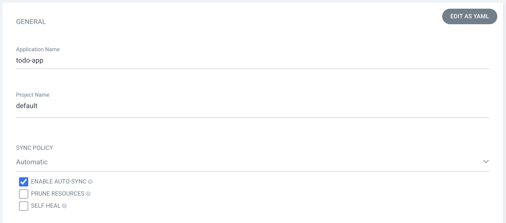
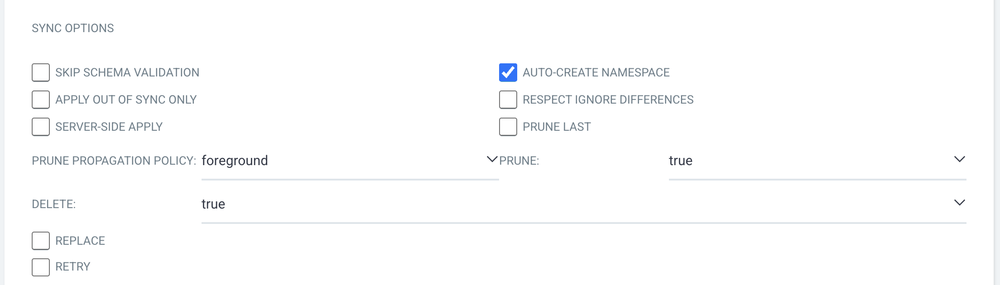
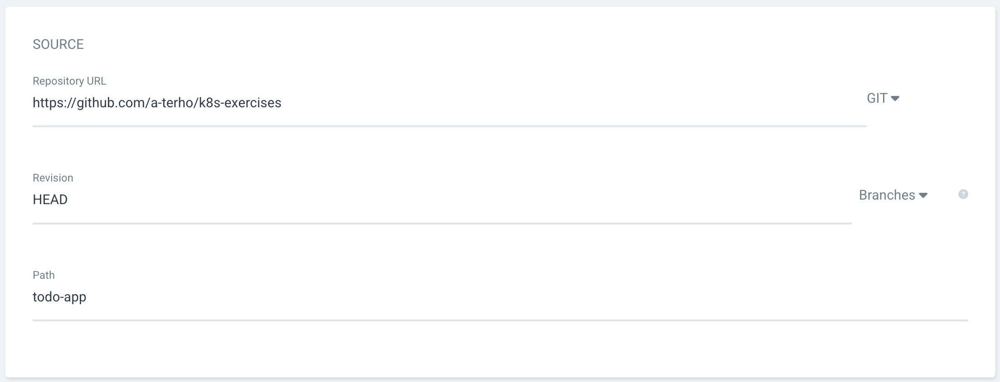
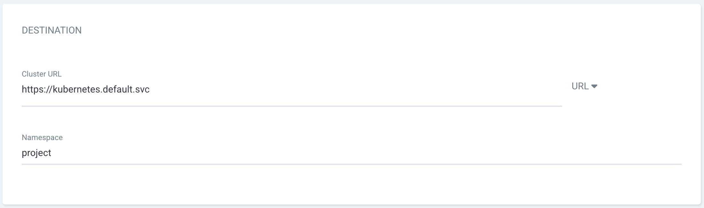
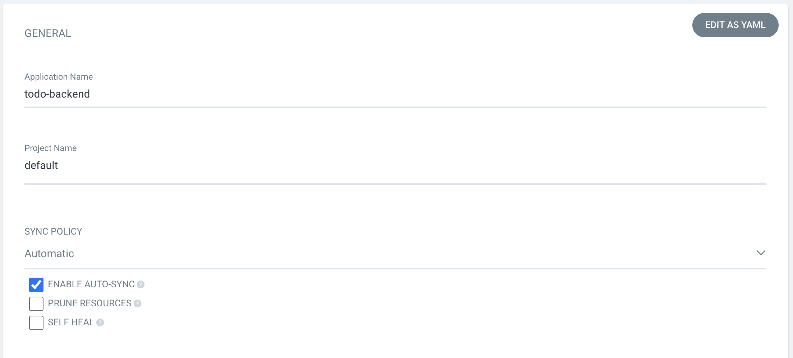
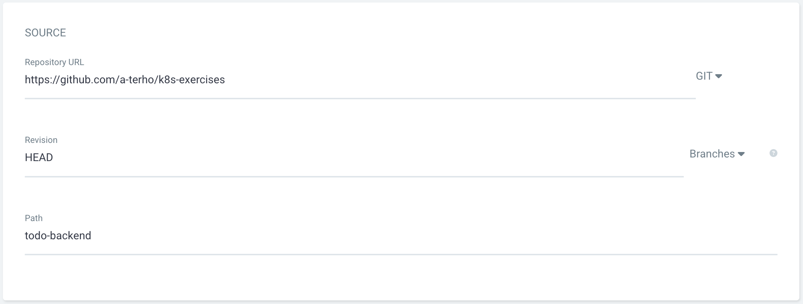

# add todo-app and todo-backend as ArgoCD apps

First make sure the Kubernetes cluster is running on GKE and `kubectl` points to cluster context.

Add ArgoCD to the cluster:

```bash
kubectl create namespace argocd
kubectl apply -n argocd --server-side --force-conflicts -f https://raw.githubusercontent.com/argoproj/argo-cd/stable/manifests/install.yaml
```

Then add a way to access ArgoCD from outside the cluster, such as exposing the service IP through LoadBalancer resouce. IP can be printed with the following command when it is available.

```bash
kubectl patch svc argocd-server -n argocd -p '{"spec": {"type": "LoadBalancer"}}'
```

```bash
echo "http://$(kubectl get svc --namespace=argocd | grep "LoadBalancer" | awk '{print $4}')"
```

Login to ArgoCD. Default `admin` account password can be printed with this command:

```bash
kubectl get -n argocd secrets argocd-initial-admin-secret -o yaml | grep "password:" | awk '{print $2}' | base64 -d
```

Create two **NEW APP**s with following settings:

First, **todo-app**





Second, **todo-backend**





In order for the automated workflow to work properly, reference [README.md file in the workflows folder](../../.github/workflows/README.md) for GKE initialization and repository setup. In addition, GitHub Actions permissions need to changed under **Settings** -> **Actions** -> **General** -> **Workflow permissions** to **Read and write permissions**.
